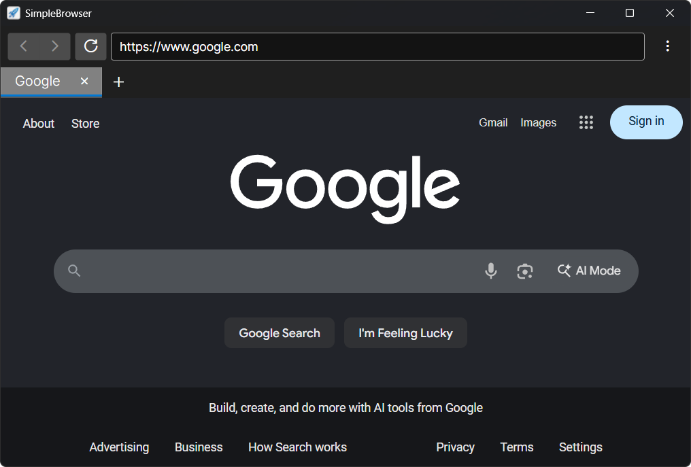

#  SimpleBrowser

A lightweight, tab-based desktop web browser built with C# and .NET 10, powered by the Avalonia UI framework.

On Linux, Firefox is slow to start, and Chrome is a memory hog that requires keyring authentication and password management. 
SimpleBrowser is fast, lightweight, and built with core daily browsing features and none of the bloat.

## Demo

<video src="https://github.com/user-attachments/assets/f6972c79-9774-4db5-b661-5b28bead7ad8" autoplay loop muted playsinline width="100%"></video>

*Launch speed benchmark recorded on a fresh Arch Linux VM with LXQt in VMware Workstation Pro:*

* **RAM:** 16 GB assigned (32 GB Host)
* **CPU:** 4 Cores (Intel i5-12400F Host)
* **Integration:** VMware Tools installed

## Features

- **Tabbed Browsing** – Open and manage multiple tabs simultaneously
- **Navigation Controls** – Back, Forward, Refresh, and Stop buttons with a loading progress indicator
- **Address Bar** – URL input with automatic `https://` protocol detection
- **Bookmarks** – Add, remove, and clear bookmarks with persistent JSON storage
- **Browsing History** – Automatically logs visited pages with timestamps, persisted between sessions
- **Sidebar Panels** – Toggle bookmarks and history sidebars for quick access
- **Multiple Windows** – Open additional browser windows
- **Downloads Shortcut** – Quick-open the system Downloads folder
- **Modern UI** – Fluent Design styling with dark theme support

## Tech Stack

| Technology | Version |
|---|---|
| .NET | 10.0 |
| Avalonia UI | 12.1.0 |
| CommunityToolkit.Mvvm | 8.4.2 |
| FluentIcons.Avalonia | Latest |

## Architecture

The project follows the **MVVM** pattern with a dedicated service layer:
